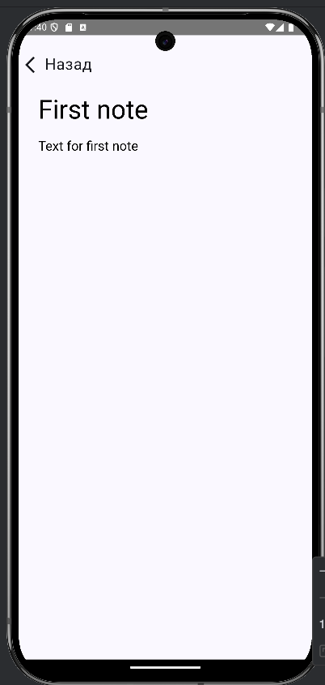
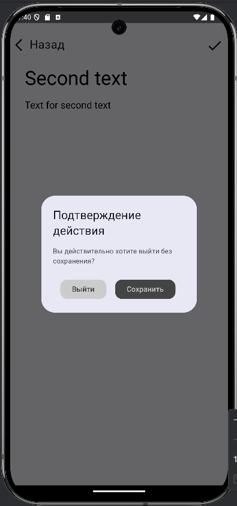

# Notes
The main screen displays clickable notes, by clicking on which you can edit the note (regular tap) and delete the note (long press). Also there is a button for addition new notes.

    
    

On the edit/add note screen we will see a screen where we can write the title and text of the note. If we want to exit without saving, we confirm our actions in the dialog. There is also a save state button.

    
    

# Stack

- Clean Architecture
- Multi Module
- MVVM
- ROOM
- KOIN
- Compose
- Coroutines
- Flow
